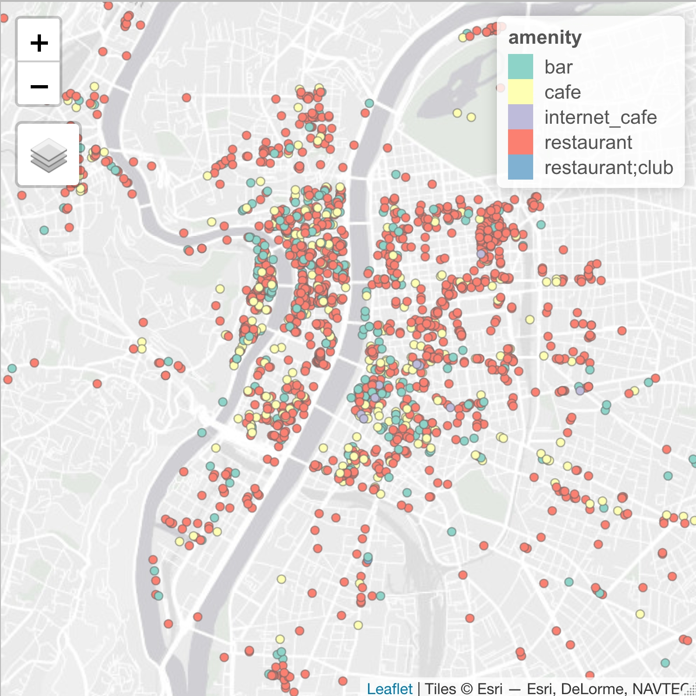

# get_osm.R

**Description**: This script extracts [OpenStreetMap](https://www.openstreetmap.org) data as a simple feature object in R using the [Overpass](https://overpass-turbo.eu) API and the [osmtogeojson](https://tyrasd.github.io/osmtogeojson) utility. 

**Author**: Clement Gorin, gorinclem@gmail.com

## Requirements

```bash
#!/usr/bin/env bash

sudo apt install npm
npm install -g osmtogeojson
```

## Usage

The script should be executed interactively. The queries are written in the [Overpass Query Language](https://wiki.openstreetmap.org/wiki/Overpass_API/Overpass_QL). This example extracts amenities cafes, bars and restaurants in Lyon, France.

```r
#!/usr/bin/env Rscript

# Sources get_oms.R
source("https://raw.githubusercontent.com/goclem/get_osm/main/get_osm.R")

# Extracts OSM data
check_requirements()
query    <- "[timeout:60];area[admin_level=8][name=Lyon]->.a;nwr[amenity~\'^cafe$|^bar$|^restaurant$\'](area.a);out center;"
response <- get_osm(query)
response <- select(response, id, amenity, name)

# Check
tmap_mode("view")
tm_shape(response) +
  tm_dots("amenity") 
```

{:height="200px" width="500px"}

## Resources

- OpenStreetMap [terms of use](https://wiki.osmfoundation.org/wiki/Terms_of_Use)