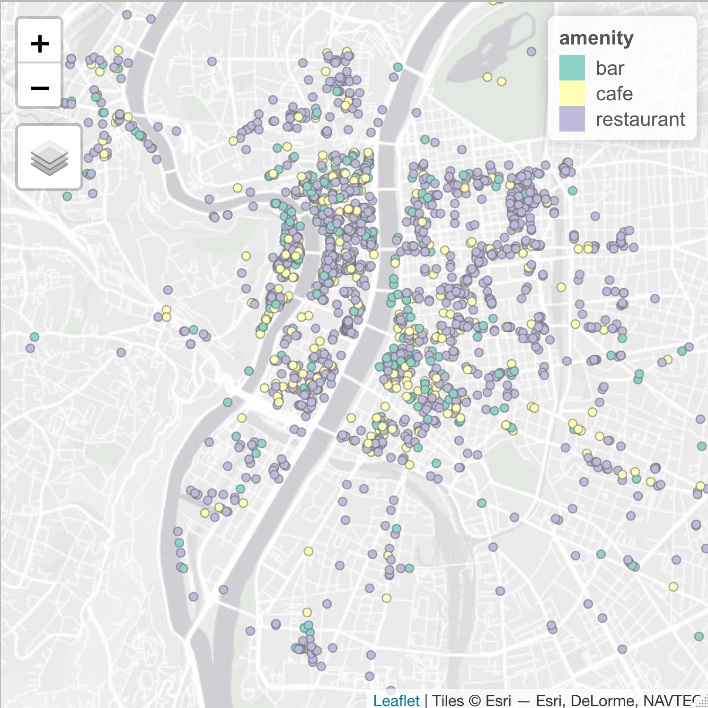

# get_osm.R

**Description**: This script extracts OpenStreetMap data as a simple feature object in R using the Overpass API and the osmtogeojson utility.

**Author**: Clement Gorin, gorinclem@gmail.com

## Requirements

```bash
#!/usr/bin/env bash

sudo apt install npm
npm install -g osmtogeojson
```

## Usage

This example extracts amenities in Lyon.

```r
#!/usr/bin/env Rscript

# Extracts OSM data
check_status()
query    <- "[timeout:300];area[admin_level=8][name=Lyon]->.a;nwr[amenity~\'cafe|bar|restaurant\'](area.a);out center;"
response <- get_osm(query)
response <- select(response, id, amenity, name)

# Check
tmap_mode("view")
tm_shape(response) +
  tm_dots("amenity") 
```

{width=50%}